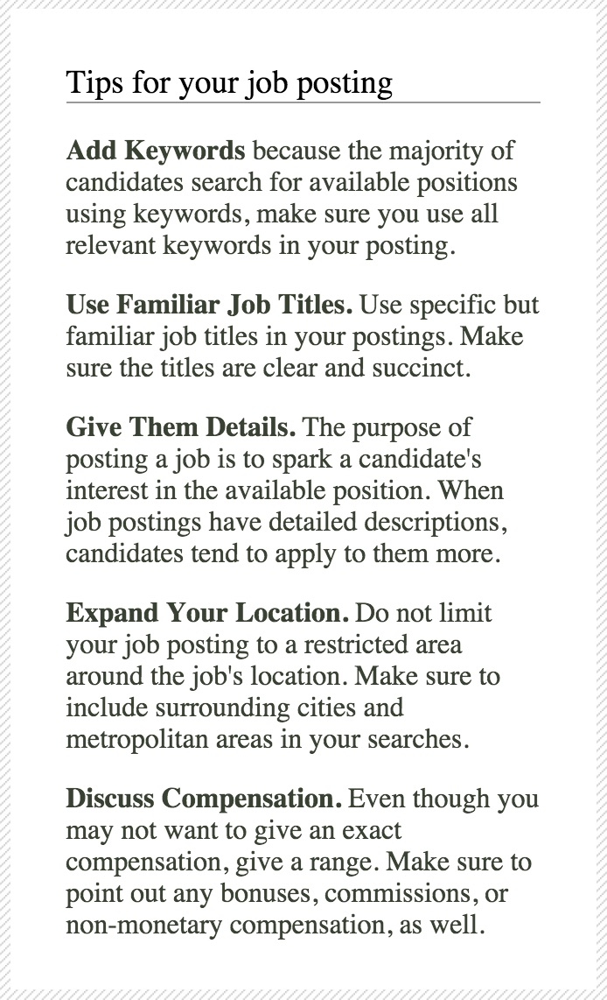
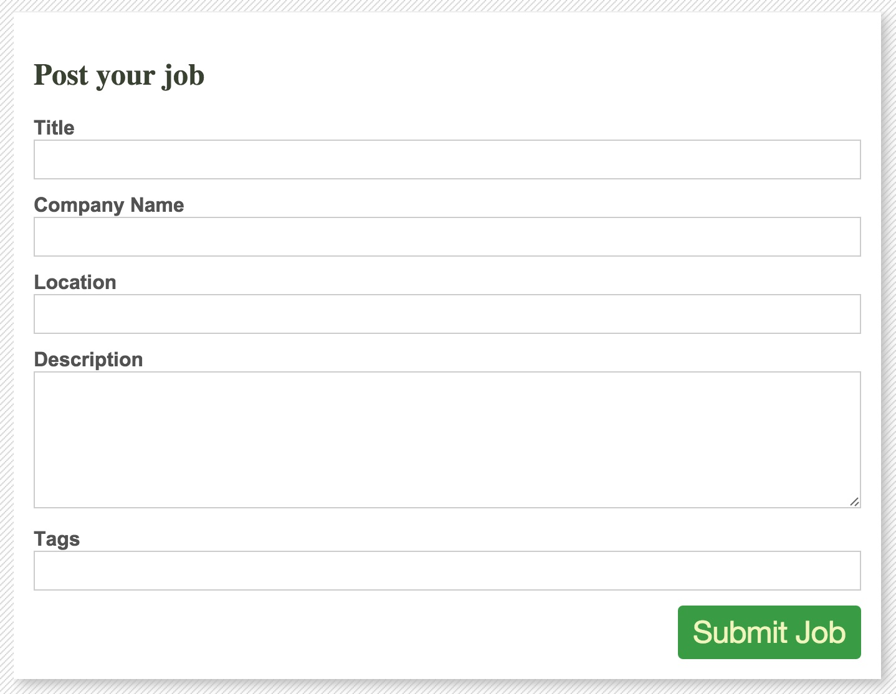
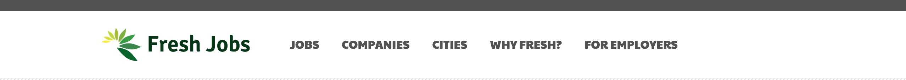
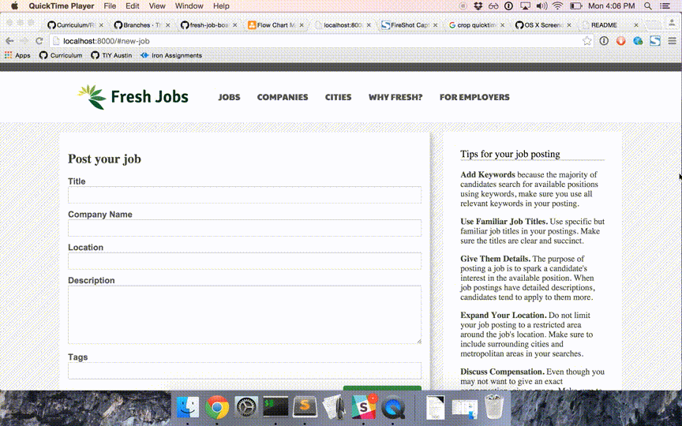
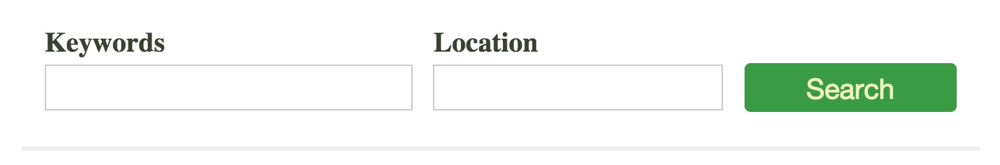
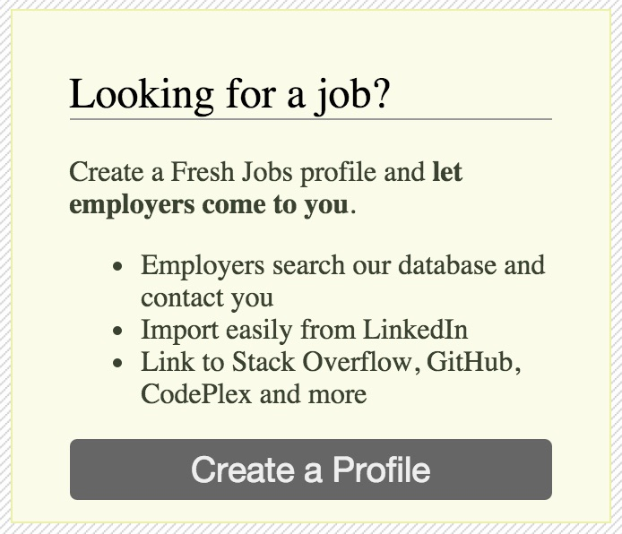
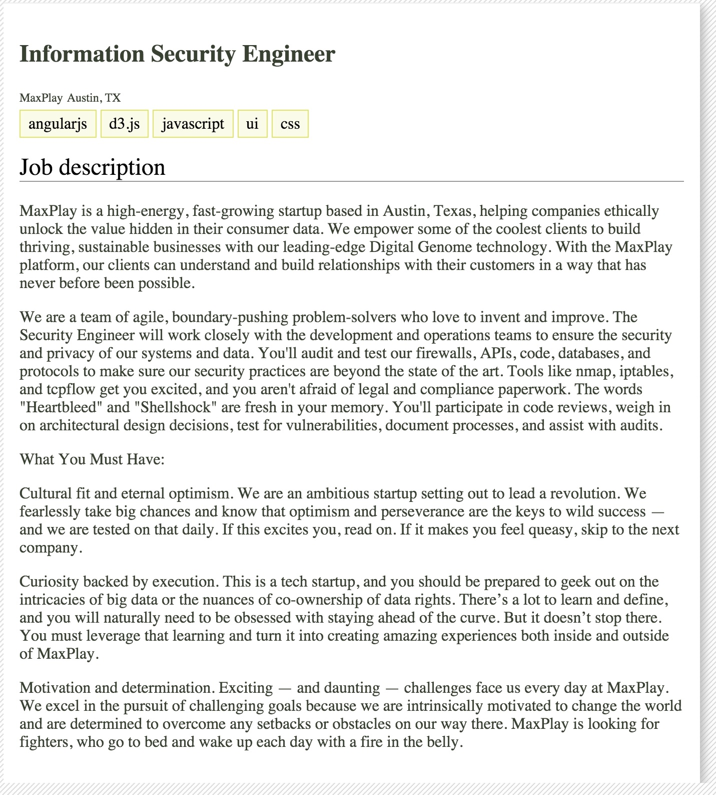
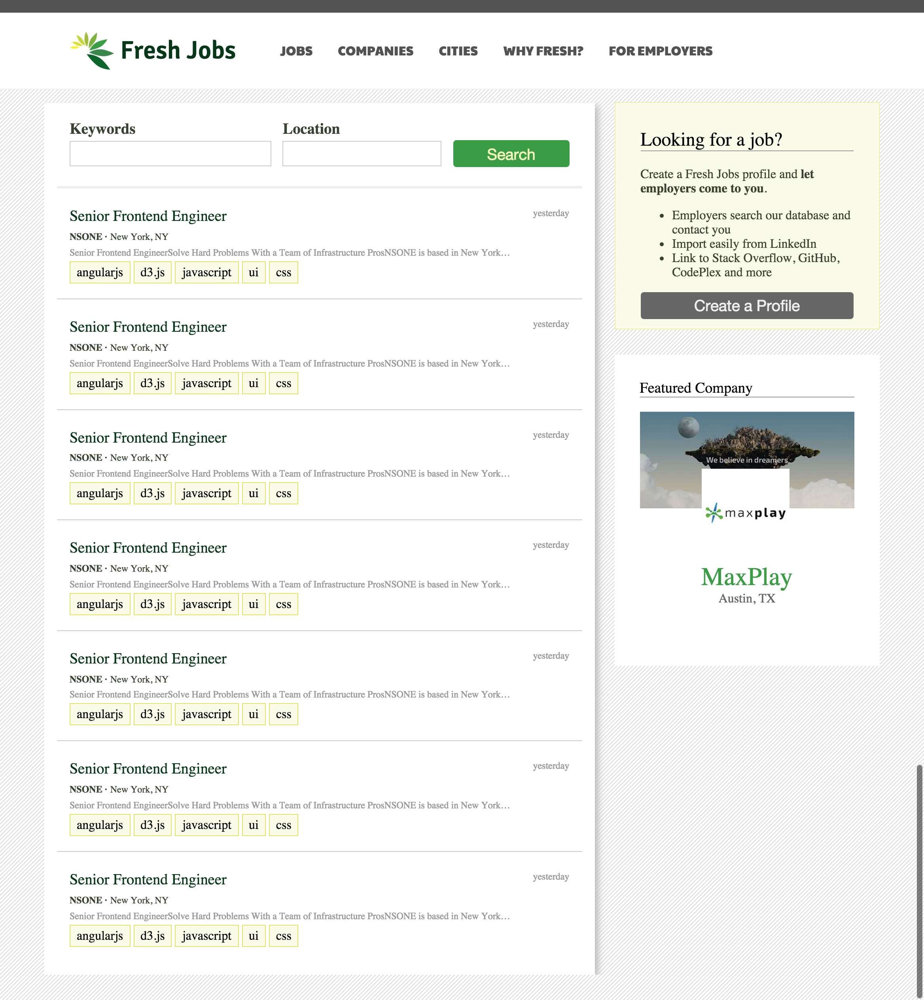
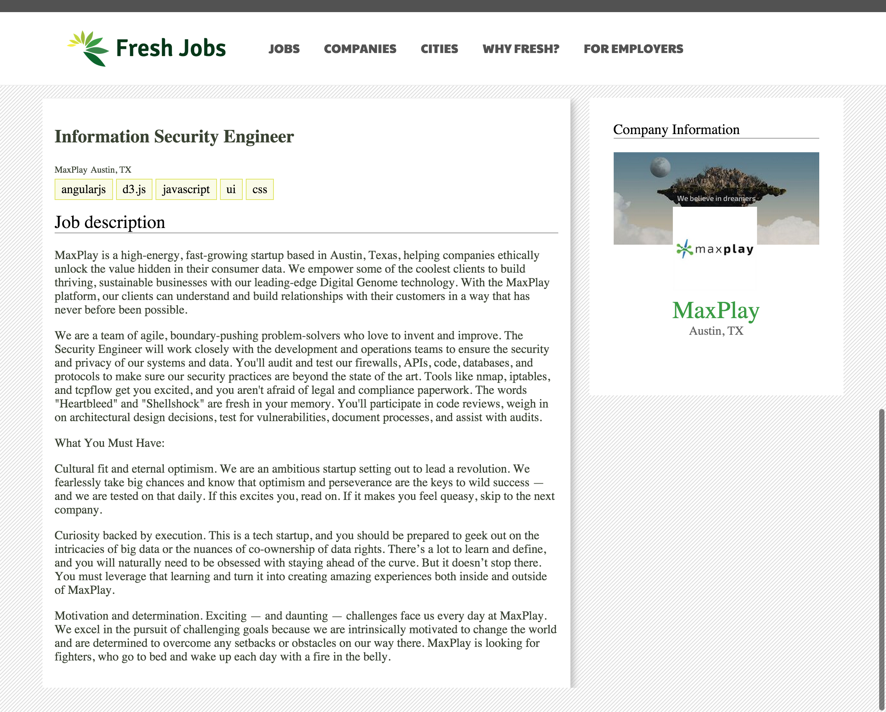
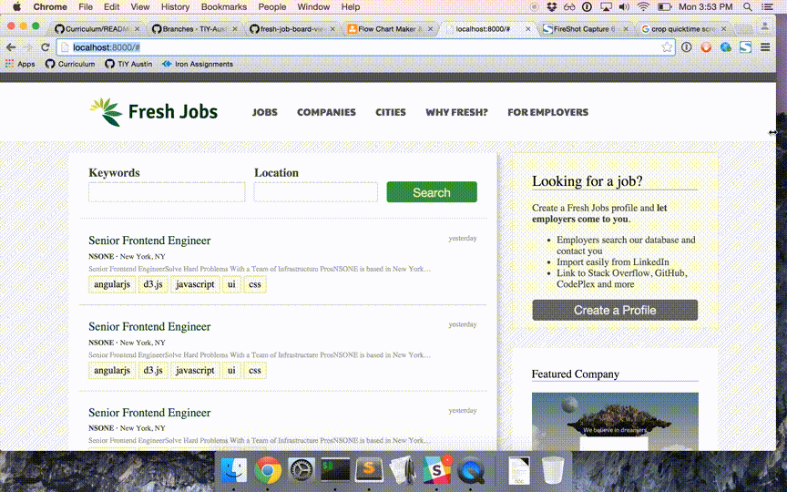

# Fresh Job Board

## Description
Create a job board using Backbone and React

## Objectives

### Learning Objectives

After completing this assignment, you should…

* Understand how to create components with React
* Understand the difference between JSX and HTML
* Understand how to nest components with React

### Performance Objectives

After completing this assignment, you be able to effectively use

* React components
* JSX

## Details

### Deliverables

* A repo containing at least:
  * `scripts/main.js`
  * `scripts/components/JobTipsComponent.js`
  * `scripts/components/JobFormComponent.js`
  * `scripts/components/NavigationComponent.js`
  * `scripts/components/AddJobPageComponent.js`
  * `styles/main.scss`
  * `index.html`

### Requirements

* Use JSX and React to create the components outlined below.
* Your final add jobs page should be responsive.

## Normal Mode

Develop the following components using Sass and JSX. Your components should be flexible in size. Their width should stretch to fit any container that they are placed inside and their height should expand to fit whatever amount of content is put inside of them. Don't worry about replicating the striped background inside of your components.

1. Job tips component

	

1. Job form component. Hint: you will need to close out your form elements with a closing slash like so: `<input type="text" />`.

	

1. Navigation component

	

1. Create an add job page component that includes all of the three components that you have built above:

	
            
## Hard Mode

Develop the following components using Sass and JSX. Your components should be flexible in size. Their width should stretch to fit any container that they are placed inside and their height should expand to fit whatever amount of content is put inside of them. Don't worry about replicating the striped background inside of your components.

1. Job row component

	

1. Filter box component

	

1. Information box component

	

1. Company box component

	

1. Job details component

	
            
## Nightmare Mode

Build out components for the following pages using (nesting) the components that you have already created:

1. Jobs List Page

	

1. Jobs Details Page

	

These pages should be responsive. See below for an example of how they should scale with screen size:

Now use a Backbone router to allow switching back and forth between those pages via the navigation component.

* Clicking on the "Fresh Jobs" text or logo in the navigation should take you to the jobs list page.
* Clicking on the jobs link in the navigation should take you to the jobs list page.
* Clicking on the "For Employers" link in the navigation should take you to the add job page.
* Clicking on any of the job titles on the job list page should take you to the job details page.

## Notes

This should be pretty mostly an HTML and CSS assignment, but within the context of React components. All of the images that you need are located in the [images folder](/images);

## Additional Resources

* Read the notes on the React [render method](https://github.com/alarner/react-recipes/blob/master/respond-to-user-actions-simple/scripts/components/LikeButton.js)
* [React in seven minutes](https://egghead.io/lessons/react-react-in-7-minutes)
