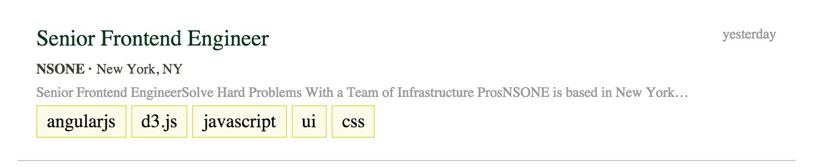

# Fresh Job Board

## Description
Create a job board using Backbone and React

## Objectives

### Learning Objectives

After completing this assignment, you should…

* Understand how to create components with React
* Understand the difference between JSX and HTML
* Understand how to nest components with React

### Performance Objectives

After completing this assignment, you be able to effectively use

* React components
* JSX

## Details

### Deliverables

* A repo containing at least:
  * `scripts/main.js`
  * `index.html`

### Requirements

* Use 

## Normal Mode

Develop the following components using Sass and JSX. Your components should be flexible in size. Their width should stretch to fit any container that they are placed inside and their height should expand to fit whatever amount of content is put inside of them. Don't worry about replicating the striped background inside of your components.

1. Job tips component

	

1. Job form component. Hint: you will need to close out your form elements with a closing slash like so: `<input type="text" />`.

	

1. Navigation component

	

1. Create an add job component that includes all of the three components that you have built above:

	
            
## Hard Mode

Develop the following components using Sass and JSX. Your components should be flexible in size. Their width should stretch to fit any container that they are placed inside and their height should expand to fit whatever amount of content is put inside of them. Don't worry about replicating the striped background inside of your components.

1. Job row component

	

1. Filter box component

	

1. Information box component

	

1. Company box component

	

1. Job details component

	
            

## Notes

This should be pretty mostly an HTML and CSS assignment, but within the context of React components. All of the images that you need are located in the [images folder](/images);

## Additional Resources

* Read the notes on the React [render method](https://github.com/alarner/react-recipes/blob/master/respond-to-user-actions-simple/scripts/components/LikeButton.js)
